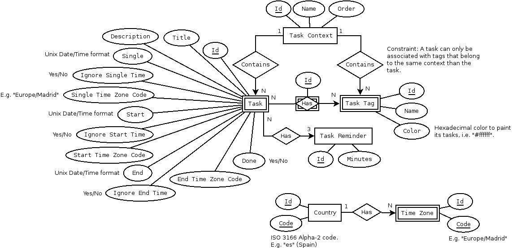

Workpage
========
Workpage is a simple productivity manager for Android. It allows you to note any task that you have to do or any idea, helping you to free your mind.

Workpage is open source software (license GPL 3.0). The source code is available in GitHub:
https://github.com/jajimenez/workpage

Application available in Google Play:
https://play.google.com/store/apps/details?id=jajimenez.workpage

Features
--------
1. **Contexts:** Tasks are groupped by "contexts", helping you to focus on one context (e.g. "Personal", "Work"...).
2. **Tags:** They allow you to classify and filter the tasks of a particular context.
3. **Colors:** You can asily associate a task with one or more tags using colors.
4. **Flexible dates/times:** No Date, Single Date or Date Range.
5. **Time zone support:** You can set specific time zones for each task. For a single task, you can set the start date on a specific time zone and the deadline on another time zone.
6. **Reminders:** Every task can optionally have reminders.
7. **Data export/import:** You can make a **backup** of your data into a file and recover it later, in your device or in another.
8. **Available languages:** English, Spanish and German.

Project data
------------
* **Development version:** 0.9.0
* **Release version:** 0.8.0
* **Author:** Jose A. Jimenez (jajimenezcarm@gmail.com)
* **License:** GPL 3.0

Requirements
------------
Android 4.4 (API Level 19)

Screenshot
----------

Database Model
--------------

