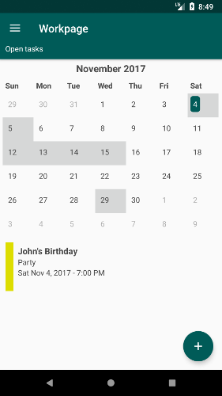
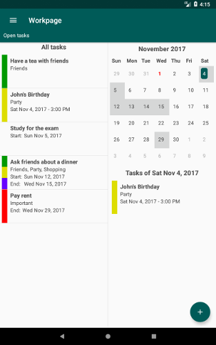

Workpage
========
Workpage is a simple task manager for Android. Useful to
follow methodologies like GTD (Getting Things Done).

Workpage is an open source software.

Features
--------
* Contexts ("Personal", "Work"...)
* Tags
* Colors
* List and calendar
* No date, single date and date range
* Time zones
* Reminders
* Data export and import
* For phones and tablets
* Languages: English, Spanish and German

Project data
------------
* Development version: 0.10.0
* Release version: 0.9.1
* Author: Jose A. Jimenez (jajimenezcarm@gmail.com)
* License: GPL 3.0

Requirements
------------
* Android 4.4 (API Level 19)

Links
-----
* Website:
  https://github.com/jajimenez/workpage

* Application in Google Play:
  https://play.google.com/store/apps/details?id=jajimenez.workpage

Screenshots
-----------
  

Database model
--------------

